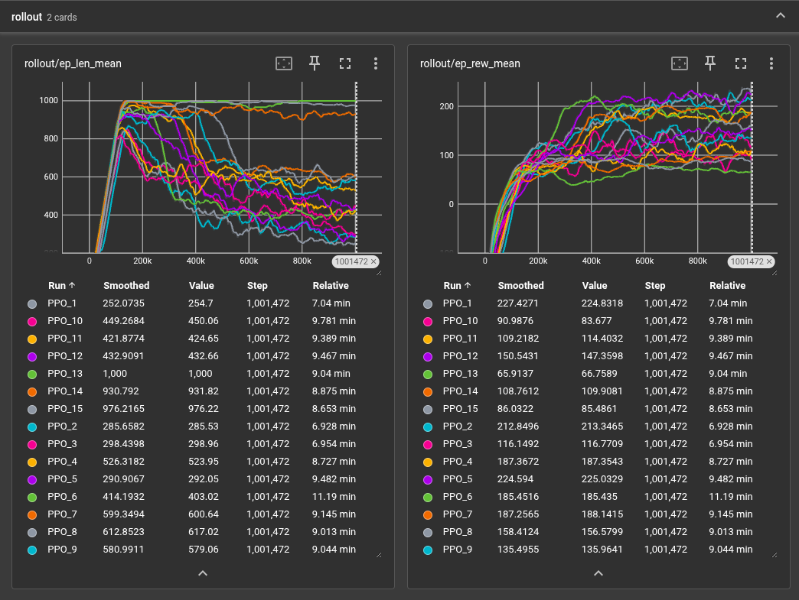

# ppo_cmpr_study

I tested three PPO modifications. Baseline PPO scored ≈185 with high variance (std ≈48). Adding observation normalization improved both stability and performance (≈199, std ≈18). In contrast, distance-based reward shaping reduced the mean to ≈160, and stronger exploration (gSDE/param-noise) performed even worse (≈84–147). So, while obs-norm is clearly beneficial, extra shaping and exploration actually degraded PPO on this already well-tuned environment.

## Mapping: PPO Runs → Variants

### Baseline PPO (no obs norm, default reward, default exploration)
- PPO_1
- PPO_2
- PPO_3  

### PPO + Observation Normalization (best variant)
- PPO_4
- PPO_5
- PPO_6  

### PPO + Observation Normalization + Extra Reward Shaping
- PPO_7
- PPO_8
- PPO_9  

### PPO + Observation Normalization + gSDE / “param_noise”
- PPO_10
- PPO_11
- PPO_12  

### PPO + Observation Normalization + Entropy Annealing
- PPO_13
- PPO_14
- PPO_15  
